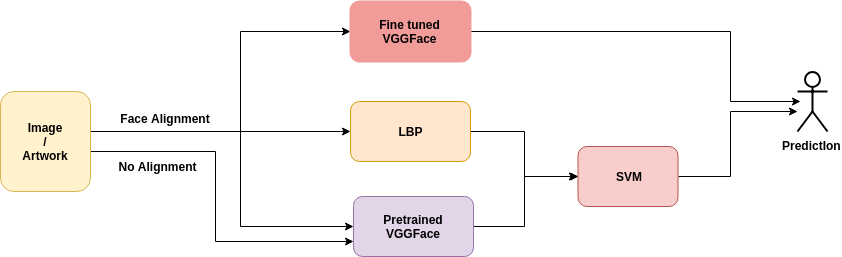
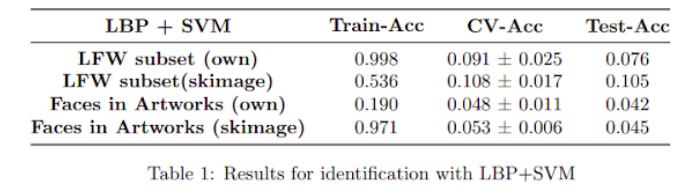
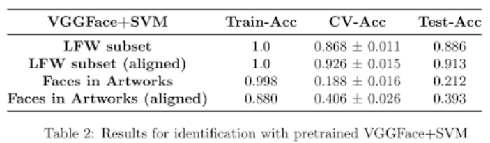

# Face Identification In Artwork
* Face identification of people in artwork using LBP, SVM and VGGFace. 

## Dataset
* Contains artworks belong to many historical figures
* Collected from Google Image Search
* Could be given access upon request

## Pipeline

## Results

  

  

